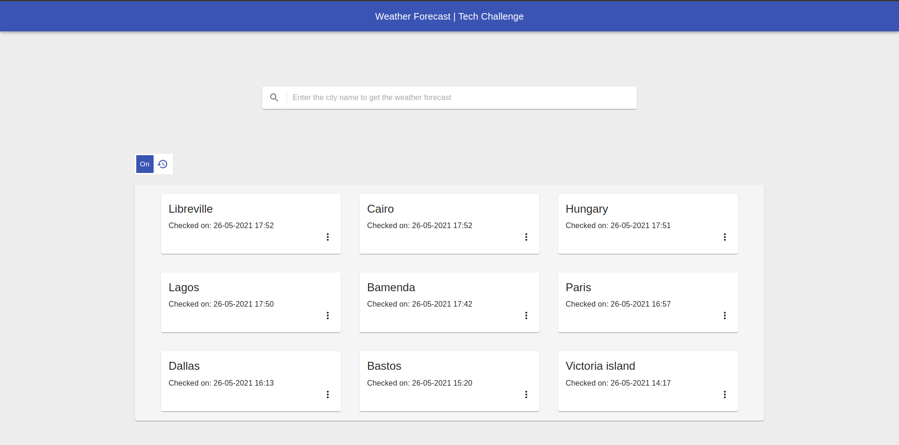
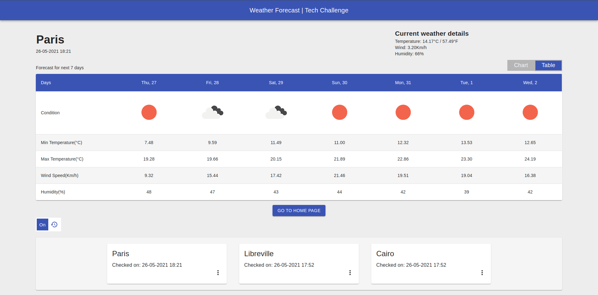
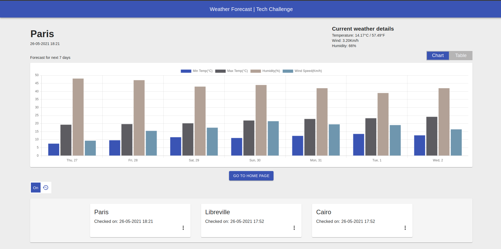

# A 7 Day Weather Forecast Application

An application used to get a 7 day weather forecast for any city the user searches, built with React, JavaScript, and Material-UI.

# APP screenshots

Installation and Setup Instructions

Clone down this repository. You will need node and yarn installed globally on your machine.

Installation:

## Available Scripts

In the project directory, you can run:

### `yarn start`

Runs the app in the development mode.\
Open [http://localhost:3000](http://localhost:3000) to view it in the browser.

The page will reload if you make edits.\
You will also see any lint errors in the console.

### `yarn build`

Builds the app for production to the `build` folder.\
It correctly bundles React in production mode and optimizes the build for the best performance.

The build is minified and the filenames include the hashes.\
Your app is ready to be deployed!

See the section about [deployment](https://facebook.github.io/create-react-app/docs/deployment) for more information.

### `yarn eject`

## To Visit App:

localhost:3000

This was a 2 week long project. The technologies implemented in this project are React, React-Router-Dom, Axios, ChartJS-2, MomentJS, React-Switch, React-Switch-Selector, Material-UI and a significant amount of VanillaJS, JSX, and CSS. I chose to use the create-react-app boilerplate to minimize initial setup.
